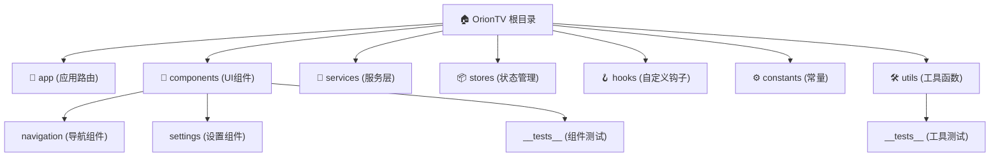

# CLAUDE.md

This file provides guidance to Claude Code (claude.ai/code) when working with code in this repository.

## 变更记录 (Changelog)

### 2025年08月29日 16:16:03
- 项目初始化：完成架构扫描与文档生成
- 新增模块结构图（Mermaid）和详细模块索引
- 完成多平台响应式设计架构分析
- 新增状态管理（Zustand）和服务层架构文档

## Project Overview

OrionTV is a React Native TVOS application for streaming video content, built with Expo and designed specifically for TV platforms (Apple TV and Android TV). This is a frontend-only application that connects to external APIs and includes a built-in remote control server for external device control.

## Key Commands

### Development Commands

#### TV Development (Apple TV & Android TV)
- `yarn start` - Start Metro bundler in TV mode (EXPO_TV=1)
- `yarn android` - Build and run on Android TV
- `yarn ios` - Build and run on Apple TV
- `yarn prebuild` - Generate native project files for TV (run after dependency changes)
- `yarn build` - Build Android APK for TV release

#### Testing Commands
- `yarn test` - Run Jest tests with watch mode
- `yarn test-ci` - Run Jest tests for CI with coverage
- `yarn test utils` - Run tests for specific directory/file pattern
- `yarn lint` - Run ESLint checks
- `yarn typecheck` - Run TypeScript type checking

#### Build and Deployment
- `yarn copy-config` - Copy TV-specific Android configurations
- `yarn build-debug` - Build Android APK for debugging
- `yarn clean` - Clean cache and build artifacts
- `yarn clean-modules` - Reinstall all node modules

## 架构总览

### 项目愿景
OrionTV 旨在为多平台TV设备提供优质的视频流媒体体验，支持Apple TV、Android TV以及移动设备的响应式适配。

### 多平台响应式架构

#### 设备检测与自适应
- **断点机制**：宽度 <768px (mobile)、768-1023px (tablet)、≥1024px (tv)
- **组件变体**：`.tv.tsx`、`.mobile.tsx`、`.tablet.tsx` 文件扩展名
- **响应式工具**：`DeviceUtils` 和 `ResponsiveStyles` 自适应布局
- **交互模式**：触摸交互 vs 遥控器导航

#### TV优化特性
- **遥控器处理**：HWEvent 硬件事件处理
- **焦点管理**：TV特定的焦点状态和导航流程
- **手势支持**：长按、方向寻址、自动隐藏控件
- **10英尺体验**：针对电视观看距离优化的UI设计

### 模块结构图

## 模块索引

| 模块路径 | 职责描述 | 关键文件 | 测试覆盖 |
|----------|----------|----------|----------|
| **app/** | 应用路由和页面组件 | `_layout.tsx`, `index.tsx`, `play.tsx` | ❌ 无测试 |
| **components/** | 可重用UI组件库 | `VideoCard.tsx`, `PlayerControls.tsx` | ✅ 基础测试 |
| **services/** | 外部API与数据服务 | `api.ts`, `remoteControlService.ts` | ❌ 无测试 |
| **stores/** | Zustand状态管理 | `homeStore.ts`, `playerStore.ts` | ❌ 无测试 |
| **hooks/** | 自定义React钩子 | `useTVRemoteHandler.ts`, `useResponsiveLayout.ts` | ❌ 无测试 |
| **constants/** | 应用常量配置 | `UpdateConfig.ts`, `Colors.ts` | ❌ 无测试 |
| **utils/** | 通用工具函数 | `DeviceUtils.ts`, `ResponsiveStyles.ts` | ✅ 完整测试 |

### Multi-Platform Responsive Design

OrionTV implements a sophisticated responsive architecture supporting multiple device types:
- **Device Detection**: Width-based breakpoints (mobile <768px, tablet 768-1023px, TV ≥1024px)
- **Component Variants**: Platform-specific files with `.tv.tsx`, `.mobile.tsx`, `.tablet.tsx` extensions
- **Responsive Utilities**: `DeviceUtils` and `ResponsiveStyles` for adaptive layouts and scaling
- **Adaptive Navigation**: Different interaction patterns per device type (touch vs remote control)

### State Management Architecture (Zustand)

Domain-specific stores with consistent patterns:
- **homeStore.ts** - Home screen content, categories, Douban API data, and play records
- **playerStore.ts** - Video player state, controls, and episode management  
- **settingsStore.ts** - App settings, API configuration, and user preferences
- **remoteControlStore.ts** - Remote control server functionality and HTTP bridge
- **authStore.ts** - User authentication state
- **updateStore.ts** - Automatic update checking and version management
- **favoritesStore.ts** - User favorites management

### Service Layer Pattern

Clean separation of concerns across service modules:
- **api.ts** - External API integration with error handling and caching
- **storage.ts** - AsyncStorage wrapper with typed interfaces
- **remoteControlService.ts** - TCP-based HTTP server for external device control
- **updateService.ts** - Automatic version checking and APK download management
- **tcpHttpServer.ts** - Low-level TCP server implementation

### TV Remote Control System

Sophisticated TV interaction handling:
- **useTVRemoteHandler** - Centralized hook for TV remote event processing
- **Hardware Events** - HWEvent handling for TV-specific controls (play/pause, seek, menu)
- **Focus Management** - TV-specific focus states and navigation flows
- **Gesture Support** - Long press, directional seeking, auto-hide controls

## 运行与开发

### 环境要求
- Node.js 18+
- Yarn 1.22+
- Expo CLI 51.x
- React Native TVOS 0.74.x

### 开发流程
1. **初始设置**：`yarn install`
2. **TV开发**：`yarn start` （自动启用 EXPO_TV=1）
3. **构建原生**：`yarn prebuild` （依赖变更后必须执行）
4. **平台运行**：`yarn android` / `yarn ios`

### 重要开发注意事项
- 新增依赖后必须运行 `yarn prebuild`
- 使用 `yarn copy-config` 应用TV特定的Android配置
- TV组件需要焦点管理和遥控器支持
- 测试需覆盖TV、平板、移动端的响应式布局

## Key Technologies

- **React Native TVOS (0.74.x)** - TV-optimized React Native with TV-specific event handling
- **Expo SDK 51** - Development platform providing native capabilities and build tooling
- **TypeScript** - Complete type safety with `@/*` path mapping configuration
- **Zustand** - Lightweight state management for global application state
- **Expo Router** - File-based routing system with typed routes
- **Expo AV** - Video playback with TV-optimized controls

## 测试策略

### 当前测试状态
- **覆盖模块**：`utils/` （完整测试）、`components/` （基础测试）
- **测试框架**：Jest with Expo preset
- **测试模式**：单元测试为主，集成测试缺失
- **覆盖报告**：支持CI兼容的覆盖率报告

### 测试缺口
- 缺少 `stores/`、`services/`、`hooks/` 模块测试
- 缺少端到端测试
- 缺少多平台响应式测试
- 缺少TV遥控器交互测试

## Development Workflow

### TV-First Development Pattern

This project uses a TV-first approach with responsive adaptations:
- **Primary Target**: Apple TV and Android TV with remote control interaction
- **Secondary Targets**: Mobile and tablet with touch-optimized responsive design
- **Build Environment**: `EXPO_TV=1` environment variable enables TV-specific features
- **Component Strategy**: Shared components with platform-specific variants using file extensions

### Testing Strategy

- **Unit Tests**: Comprehensive test coverage for utilities (`utils/__tests__/`)
- **Jest Configuration**: Expo preset with Babel transpilation
- **Test Patterns**: Mock-based testing for React Native modules and external dependencies
- **Coverage Reporting**: CI-compatible coverage reports with detailed metrics

### Important Development Notes

- Run `yarn prebuild` after adding new dependencies for native builds
- Use `yarn copy-config` to apply TV-specific Android configurations
- TV components require focus management and remote control support
- Test on both TV devices (Apple TV/Android TV) and responsive mobile/tablet layouts
- All API calls are centralized in `/services` directory with error handling
- Storage operations use AsyncStorage wrapper in `storage.ts` with typed interfaces

### Component Development Patterns

- **Platform Variants**: Use `.tv.tsx`, `.mobile.tsx`, `.tablet.tsx` for platform-specific implementations
- **Responsive Utilities**: Leverage `DeviceUtils.getDeviceType()` for responsive logic
- **TV Remote Handling**: Use `useTVRemoteHandler` hook for TV-specific interactions
- **Focus Management**: TV components must handle focus states for remote navigation
- **Shared Logic**: Place common logic in `/hooks` directory for reusability

## 编码规范

### TypeScript 规范
- 严格类型检查：`strict: true`
- 路径别名：使用 `@/*` 导入模块
- 接口优先：定义清晰的类型接口
- 空值检查：避免 undefined/null 错误

### 组件开发规范
- **平台变体**：遵循 `.tv.tsx`、`.mobile.tsx` 文件命名
- **响应式设计**：使用 `DeviceUtils` 进行设备检测
- **状态管理**：遵循 Zustand 存储模式
- **TV交互**：TV组件必须实现焦点管理

### 性能优化
- 懒加载：使用 React.lazy 延迟加载组件
- 缓存策略：API响应缓存和本地存储优化
- 内存管理：及时清理定时器和事件监听器

## Common Development Tasks

### Adding New Components
1. Create base component in `/components` directory
2. Add platform-specific variants (`.tv.tsx`) if needed
3. Import and use responsive utilities from `@/utils/DeviceUtils`
4. Test across device types for proper responsive behavior

### Working with State
1. Identify appropriate Zustand store in `/stores` directory
2. Follow existing patterns for actions and state structure
3. Use TypeScript interfaces for type safety
4. Consider cross-store dependencies and data flow

### API Integration
1. Add new endpoints to `/services/api.ts`
2. Implement proper error handling and loading states
3. Use caching strategies for frequently accessed data
4. Update relevant Zustand stores with API responses

## AI 使用指引

### 推荐的 AI 辅助任务
1. **代码生成**：基于现有模式生成新组件或存储
2. **测试编写**：为缺少测试的模块补充单元测试
3. **类型定义**：完善TypeScript接口和类型注解
4. **重构优化**：代码结构和性能优化建议

### 需要人工审核的任务
1. **状态管理变更**：Zustand存储的结构修改
2. **API接口变更**：外部服务集成的修改
3. **TV交互逻辑**：遥控器事件处理和焦点管理
4. **构建配置**：Expo配置和原生构建设置

## File Structure Notes

- `/app` - Expo Router screens and navigation
- `/components` - Reusable UI components (including `.tv.tsx` variants)
- `/stores` - Zustand state management stores
- `/services` - API, storage, remote control, and update services
- `/hooks` - Custom React hooks including `useTVRemoteHandler`
- `/constants` - App constants, theme definitions, and update configuration
- `/assets` - Static assets including TV-specific icons and banners

# important-instruction-reminders

Do what has been asked; nothing more, nothing less.
NEVER create files unless they're absolutely necessary for achieving your goal.
ALWAYS prefer editing an existing file to creating a new one.
NEVER proactively create documentation files (\*.md) or README files. Only create documentation files if explicitly requested by the User.
ALWAYS When plan mode switches to edit, the contents of plan and todo need to be output as a document.

# important-instruction-reminders
Do what has been asked; nothing more, nothing less.
NEVER create files unless they're absolutely necessary for achieving your goal.
ALWAYS prefer editing an existing file to creating a new one.
NEVER proactively create documentation files (*.md) or README files. Only create documentation files if explicitly requested by the User.